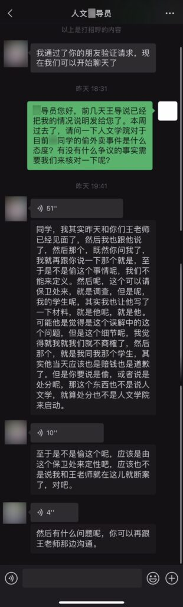

# 我在北邮被偷喜茶后的338个小时

原文链接：https://blog.hzao.top/2023/05/27/bupt-heyteaevent/

Web Archive: http://web.archive.org/web/20230608155806/https://blog.hzao.top/2023/05/27/bupt-heyteaevent/

发布者：[Hzao](https://blog.hzao.top/author/hzao/) [2023年5月27日](https://blog.hzao.top/2023/05/27/bupt-heyteaevent/) [我在北邮被偷喜茶后的338个小时有750条评论](https://blog.hzao.top/2023/05/27/bupt-heyteaevent/#comments)

> 此文章最后更新的时间为2023年6月5日21:15。[最新进展](https://blog.hzao.top/2023/05/27/bupt-heyteaevent/comment-page-2/#latest-update)

> 如果你在微信等非浏览器 app 中打开了这个页面，可能会出现十分卡顿的情况。请在浏览器中打开本页面。

> 欢迎各位友好讨论。虽然现在绝大多数朋友的发言都是理智的，我仍然提醒各位不要搞人身攻击、性别对立和人肉搜索。
>
> 该学姐确该获得处罚，也应该有改过自新的机会。假如暴露身份后受到的处罚是远超她应该得到的。我为其姓名等个人信息打码，同时为人声进行变声处理，就是为了保护其个人信息。请遵守法律，并尊重我为保护其隐私的努力。
>
> 请关注事件本身想传达出的意义，即学校应该整顿风气，对盗窃事件零容忍。我希望不偷外卖的同学，能从这个博文中获得维权和不妥协的勇气；我也希望偷外卖的同学，能从这件事情中得到震慑，回头是岸。

实在是太久没有更新博客了。这次，我想邀请你一起见证一场维护社会伦理和北邮校规尊严的实践。

北邮校园里的**偷外卖**行为实在是太常见了。但很多时候，这种行为因为涉及的金额不大，没人有精力追究。这周一（5月22日），我又一次被偷了外卖，是 4 杯喜茶。

虽然这几年我越来越随和，但不知道怎么的，这一次，我不希望那个认为我不会追究的侥幸想法，最后成真。我认为，我应该用这次机会，维护校规校纪的尊严，维护文明的校园环境。如果不是什么无心之过，那么我应该追究到底，让其受到应有的处罚。

但我没有想到的是，这个偷走我外卖的人，**居然是一个人文学院 25 岁的研三学姐**。更没有想到的是，在我耗费巨量个人精力调查事实、撰写情况说明之后，对方学院的回应让我震惊。

我不会因此止步。

我的诉求很简单，就是让北京邮电大学根据《北京邮电大学学生违纪处分管理规定 （校发〔2019〕49号）》第五章第二十一条之规定，对该同学给予严重警告处分。（“（盗窃）所涉价值未达到500 元的，给予严重警告处分”）

我花费如此多的时间和精力，**并不是为了争到钱，而是为北邮无数被偷走外卖的人争一口气。**这就是为什么，该同学后来向我原价赔偿83元之后，我马上联系喜茶门店，**将83元转给了他们**。（当晚喜茶为我重做了饮品，我认为这个损失不应该由门店承担）

在低调处理 100 多个小时之后，出于后续对我校相关部门的信心，我决定全程公开本次追究过程，并将持续更新，希望能**记录和发扬我校相关部门维护校规校纪和良好环境的决心，同时震慑盗窃外卖的违法行为**，以供他校参考。

> Was mich nicht umbringt, macht mich stärker.
> 杀不死我们的，使我们更强大。
>
> 德国哲学家，尼采

### 一、那天晚上发生了什么

事情主要是这样的，2023年5月22日晚上，我们4位同学在喜茶微信小程序点了4杯喜茶。

18:43，外卖员打电话通知喜茶已入柜，此时我刚好走到沙河校区西门口，距离外卖柜只有几十米。18:44，我到达外卖柜，通过扫码并输入自己的手机尾号，得知我有一个在A柜84号柜的外卖待取餐。然而，当我走到A柜84号柜时，发现里面是空的。

18:45，我向外卖员致电，向其确认是否已正确存放外卖。经过6分钟的交谈和排查，我们确认喜茶已经不在外卖柜。也就是说，这4杯喜茶在骑手放入柜**不到 1 分钟**时，就被偷走了。

沙河外卖柜A柜84号，2023年5月22日 18:45

19点，在确认外卖并非存错，而是被偷走之后，我联系保卫处，申请调取监控。在20:18 左右，我们已经查到该同学的住宿楼层。保卫处值班老师让我第二天早上再到保卫处进行处理。

### 二、在保卫处发生了什么

第二天，也就是5月23日（星期二），我在保卫处见到了监控锁定的盗窃者。她在接下来近一个小时的对话中，**反复对实际情况撒谎，几次更改说辞，先后甩锅美团外卖柜和自己的男友，在我的连续追问和拆穿下，承认自己的盗窃行为。**

**学姐说辞 – Beta 版**

在我进入保卫处办公室之后，该学姐主动向我解释起了她“拿走”我喜茶的原因：她的男友给她点了一份水果捞，存在了B柜的84号柜。 她去拿外卖时发现B柜84号柜没有东西，所以“下意识”地以为在A柜。她去扫A柜的二维码，输入自己的手机号之后，A 柜 84 号柜（也就是我喜茶存放的柜子）就（神奇般地）打开了。

我的常识和开发经验告诉我，B 柜物主能打开 A 柜的说法完全站不住脚。同时美团外卖柜在取餐时有取件记录，我请该学姐打开其小程序上的取件记录，上面并没有当晚 A 柜的打开记录，甚至一条记录都没有。（我猜测，她临时登录了另外一个美团账号，所以一条取件记录都没有）

在当时我以为是校内柜门没关紧，在后面的部分我会写这个柜门是如何打开的。

**你知道自己的东西是水果捞，而柜内是喜茶，为什么要拿走？**

接着我提出了另外一个问题：既然她明明知道男友给她送了水果捞，而且男友发的订单截图中有商家名称，在拿到我的外卖之后，难道没有发现这是喜茶而不是水果捞吗，为什么还要拿走？

对此，该同学当时表示：“它那个袋子是密封的，然后很高。”我追问：“但袋子上写了喜茶。”该学姐表示：“那上面没有单子，只有一个小胶带，它粘住了。”我再次追问：“可是外面袋子上写着有喜茶几个字。”

录音如下（已变声处理）：

<audio controls="" src="https://blog.hzao.top/wp-content/uploads/2023/05/%E4%B8%BA%E4%BB%80%E4%B9%88%E6%98%8E%E7%9F%A5%E6%B0%B4%E6%9E%9C%E6%8D%9E%E8%A6%81%E6%8B%BF%E8%B5%B0%E5%96%9C%E8%8C%B6-%E5%8F%98-1.mp3" __idm_id__="2990081" style="box-sizing: inherit; min-width: 300px; width: 666px; margin-top: 0px; margin-bottom: 0px;"></audio>

**打开之后也没发现是喜茶吗？为什么不放回来？**

我继续追问：“为什么你知道拿错了，但是不拿回来？”

对此，该同学当时表示：“我拿回来了。我放回去了，而且发现那个地方很多喜茶袋子都拆开了。”她假装自己放回去了，并且暗示她放回去之后喜茶被其他同学拆开拿走。

我随即追问：“那个地方确实有一袋拆开的8215号喜茶，但我的是8237号。门店重新给我做了一份，我再去取餐时没有发现任何放回去的东西。当时的值班老师也回去看了。而且当时84号柜都关了，你怎么放回去的呢？”

我也表示，“如果你说你昨晚放回去的，请告诉老师你是几点放回去的，我们可以调监控。”**对此，她沉默了。**

我再次向她重复，“如果你说你放回去了，那你说是多久放回去的，放到哪里了，**我们现在就可以调监控。**”对此该同学继续保持沉默。沉默之后，她表示：**“那我给你转钱吧。”**

录音如下（已变声处理）：

<audio controls="" src="https://blog.hzao.top/wp-content/uploads/2023/05/%E6%94%BE%E5%9B%9E%E5%8E%BB%E4%BA%86%E5%90%970329-%E5%8F%98-1.mp3" __idm_id__="2990082" style="box-sizing: inherit; min-width: 300px; width: 666px; margin-top: 0px; margin-bottom: 0px;"></audio>

**承认并非无意拿走，并甩锅男友**

接下来的交谈中，该学姐再次给出了另一个版本的说法：她第一次查外卖柜发现不在，“还回去了一趟”。然后她跟男友打电话，她以为是A柜的 84 号拿走了 B 柜的84号，于是她男友让她把 A 柜 84 号也拿走。**“他可能是赌气，就让我拿回去了”**，学姐这样说。

这个版本的意思是，该同学认为A柜84号的同学拿走了她B柜84号的外卖，所以她承认，在男友的怂恿下（当然，无法证实是男友怂恿的还是她自己要偷的），偷走了A柜84号的外卖。

我表示，取件是凭手机尾号而不是凭柜号，这种说法站不住脚。就算要报复，你也得拿相同手机尾号的吧？何况，你有证据证明 A 柜的人拿走了你的外卖吗？

即使在写这篇博文时，我仍然对这个逻辑感到不可思议。就算你真的要报复，**你哪里有证据就是 A 柜同学拿走了你的外卖呢？在没有明确证据和对象的情况下，这到底是针对性的报复，还是因为自己有一个 84 号柜的借口可以推脱，就心存侥幸呢？既然你重新来了两次外卖柜，为什么第二次来的时候不报复你本身B柜的84号柜，而要报复 A 柜呢？**既然 A 柜内的物品还没取，**你为什么不等到物主来 A 柜后和他当面对峙拿回你的物品，而是在物品刚入柜不到 1 分钟就取走呢？**

录音如下（已变声处理）：

<audio controls="" src="https://blog.hzao.top/wp-content/uploads/2023/05/%E8%A1%A8%E7%A4%BA%E7%94%B7%E5%8F%8B%E6%80%82%E6%81%BF-%E5%8F%98-1.mp3" __idm_id__="2990083" style="box-sizing: inherit; min-width: 300px; width: 666px; margin-top: 0px; margin-bottom: 0px;"></audio>

**这就是盗窃！**

在我的追问下，**该学姐承认这就是盗窃。**具体可以收听此段录音（已变声处理）：

<audio controls="" src="https://blog.hzao.top/wp-content/uploads/2023/05/%E6%89%BF%E8%AE%A4%E7%9B%97%E7%AA%83%E7%BA%A60833-0853-%E5%8F%98-3.mp3" __idm_id__="2990084" style="box-sizing: inherit; min-width: 300px; width: 666px; margin-top: 0px; margin-bottom: 0px;"></audio>

然后我们先处理了赔偿的事情，该同学赔偿了我原价83元。（我已将这83元转给为我重做的喜茶门店）
没想到十分钟之后，她再次改口，又说是因为B柜开不了，以为自己外卖在A柜，所以才去开了我的柜子。
接下来，在保卫处老师的协调下，双方导员的介入，我分别与该同学的高导员和我的王导员通话，交流了情况。双方导员都让我写一份情况说明，于是我在10:20 左右离开了保卫处。

### 三、向喜茶转账

被偷当晚，我曾在骑手建议下联系门店。沙河物美喜茶门店为我重做了饮品，并且由一位似乎是门店领导的员工向我致电。

在事实清楚之后，我认为问题不在于门店或骑手，不应该由门店员工或骑手承担损失，所以在离开保卫处后的10:25，向喜茶员工致电说明情况，并添加微信将该学姐赔偿我的原价喜茶转给了她，表示希望不要对骑手等作出处罚。

### 四、向美团外卖柜客服求证

在23日上午的交谈中，该同学一直试图将问题甩锅给美团外卖柜。她对于没有取件记录的事实表示无辜且不知情，表示是因为外卖柜小程序出错，导致她输入她的手机号也能错误地打开我的柜子，也导致了她没有取件记录。对于她打开外卖柜的方式，我们都没有一个合理的解释，我之前只能猜测是校内门未关紧。

为此，我根据沙河校区外卖柜旁的客服电话，添加了客服微信，并以物主的身份，希望他们能帮我查到该同学是用何种方式开柜的，以及确认是否真的像她说的那样，外卖柜小程序出现了异常。

该客服了解情况后，告知小程序和外卖柜绝对没有问题。

同时，该同学在22日18:44:22**使用了美团外卖柜的“信用开柜”功能**，打开了存放我喜茶的柜子！

“信用开柜”是美团外卖柜为了应对极端情况下，用户可能无法打开自己柜子的情况。用户可以选择使用自己的美团信用分，直接打开对应的柜门。但是，**使用此方法开柜需要5次点击操作，并且小程序会要求用户确认该物品是否属于自己**。

**这与该同学之前装无辜地表示自己直接用手机尾号开门相矛盾**，而且她**刻意隐瞒了自己滥用信用开柜服务的事实**。

在监控视频中，该同学从扫码到使用信用开柜打开柜子，居然只用了20秒。**这与她之前一直重复自己“真的没怎么拿过外卖”相矛盾。**如果没怎么拿过，是如何做到用这么短的时间，如此熟练地使用如此复杂的信用开柜的呢？

同样在监控视频中，可以看到该同学在拿出外卖之后还端详了好几秒，**与之前她暗示自己不知道这是喜茶相矛盾**。

（出于保护当事人的目的，这里监控视频和截图不再公开，只发给相关老师参考）

既然该同学使用了信用开柜的方式打开，那么她肯定明确地知道，要开的柜子不是自己的。同时，她在明知自己没有点喜茶的情况下，在明确端详了喜茶包装袋的情况下，拿走了她明知不属于自己的东西。

### 五、事实总结和梳理

经过以上讨论，我们可以基本确定以下事实：人文学院研三的该同学，作为**已经25岁的成年人**，在2023年5月22日晚间，因自称外卖被偷，在没有任何证据证明我与其有关的情况下，专门到北邮沙河校区外卖柜 A 柜84号柜，熟练地利用美团外卖柜的信用开柜功能，在明知该柜不可用她自己手机号打开的情况下，在确认柜内物品并非其本人所有的情况下，偷走了我和我同学购买的4杯喜茶。

在事情发生后，该同学在保卫处多次更改说法，多次撒谎，推卸责任、逃避问题。其声称是因为美团外卖柜出问题，导致本身B柜84号开成了A柜84号。实际上她故意且熟练地滥用了美团外卖柜的信用开柜功能，打开了不属于自己的外卖柜。她声称将偷走的喜茶放了回去。实际上她无法证明此事，甚至无法提供她放回的时间和地点以供调阅监控。

在处理问题时，该同学毫无歉意，一直在为自己的行为狡辩，还尝试用美团出现神奇故障等原因摆脱自己的责任，自始至终没有向我说过一句“对不起”“抱歉”的话。在我指出她没有给我道歉过时，她还狡辩说自己在转账时向我道过歉。但现场录音完整地覆盖了开始、转账、转账后至少10分钟，该同学从没有一句抱歉的话。她的话，从大事到小事，有几句是真的呢？

### 六、我的态度

多数师生对于此类事件，都没有精力追究，即使追究可能很多情况下都不了了之。

正常的一顿外卖在20至30元左右，本次事件涉及的价格是83元，如果连**将近普通外卖4倍价格的、已经抓到作案人的**外卖被盗事件都没有处罚，那么北邮的校风校纪将会变成什么样子呢？

在事件发生之后，涉事同学满口谎言、反复横跳，以为可以付钱了事，甚至至今未对我本人道歉，还就“是否向我道歉”这个问题向保卫处及其导员撒谎。她在保卫处承认盗窃之后，又向自己的导员及学院否认自己盗窃行为。

如果偷外卖的人，在经过学校大量的调查工作后，只需要支付偷走的外卖价值，**那么，在北京邮电大学偷外卖，是否是一种无风险、零损失的行为呢？**

有人私下与我沟通认为，她是一位女孩，作为男生应该大度一点。熟悉我的人应该知道，我本来就是一个宽容的人，我没有要求她支付更多的赔偿，只是让她原价赔付饮品钱（而且我还把这钱转给喜茶了）。然而，我无法代替北邮学生大度。我认为，校规校纪不应因为性别选择性执行，已经25 岁的她，对于偷盗有明确的认识，也应该为自己的行为负责。这不仅是对校规校纪的尊重，也是对于女性的尊重。一再纵容这种不良之气，将会有多少女生被偷外卖呢？

因此，即使她即将毕业，即使她是一位女生，我也将追究到底，坚决维护校园文明环境。这是对北邮师生的负责，也是对于女性的尊重。

### 七、导员沟通与处理

23日上午，保卫处虽然希望我不要追究更深的责任，但依然定性了此事确实为盗窃，并且让我联系两边导员联系沟通以给予处分。

在与双方导员沟通后，我基于以上事实与调查，撰写了近七千字的详细的情况说明，并且辅以了截图证据（当时我认为截图已足够，暂时没有添加录音）。

我很感谢我网络空间安全学院的导员及相关领导，根据相关流程，中立地与对方导员沟通协商处理此事。

周五晚，在本周的结束之时，我向人文学院的导员询问了人文学院对于此事的处理态度。

一个小时后，我收到了人文导员的回复：

对于高导员的回复，我感到非常疑惑和遗憾。

#### 1.无法认定偷盗？

对于事实中存在争议的地方，我们暂不讨论。但是对于【25岁的成年人X同学，以信用开柜的非常规方式，打开了明知道不属于自己外卖柜，在明知自己没有喜茶外卖的情况下，拿走了4杯喜茶，并且没有还回来】这个事实，我已经在《情况说明》详细说明和举证了，铁证如山。

如果说，这样都无法认定为偷盗，那么我无法评价对方的事实认定能力和道德水准。

其实该同学在当天承认盗窃的录音我也已放在上面的部分（已变声处理）：

<audio controls="" src="https://blog.hzao.top/wp-content/uploads/2023/05/%E6%89%BF%E8%AE%A4%E7%9B%97%E7%AA%83%E7%BA%A60833-0853-%E5%8F%98-2.mp3" __idm_id__="2990085" style="box-sizing: inherit; min-width: 300px; width: 666px; margin-top: 0px; margin-bottom: 0px;"></audio>

#### 2.需要保卫处定性？

虽然保卫处老师希望我不再追究，当仍已将此定性为盗窃（已变声处理）：

<audio controls="" src="https://blog.hzao.top/wp-content/uploads/2023/05/%E4%BF%9D%E5%8D%AB%E5%A4%84%E5%AE%9A%E6%80%A72256-%E5%8F%98-1.mp3" __idm_id__="2990086" style="box-sizing: inherit; min-width: 300px; width: 666px; margin-top: 0px; margin-bottom: 0px;"></audio>

在这个录音中，我们可以明确知道保卫处老师已经对此事件定性，并且该同学自己也承认。

北邮以前并非没有因为盗窃事件给予学生处分。我是根据处理过此事件的保卫处的指引，才联系导员，让导员沟通给予处分的。保卫处老师明确表示**应该由两学院沟通给予处分。**现在高导员的意思是，她又把皮球踢回给保卫处了？那么这个流程到底如何？我对这个流程表示不理解。

作为涉事学姐的直接导员，本应有责任追究调查清楚事实。对于本院学生的事情，**人文学院应该拿出歉意和认真追查的态度。**保卫处在当天早上的对话已经确认了此事件确为盗窃，只要对方学院拿出解决问题的态度，**一个电话就能核实**。

我已经代替人文学院做了巨量的调查，撰写了详细的情况说明。**难道，连给保卫处打电话沟通核实这样的事情，都需要我这个即将期末考试的学生来完成吗**？

#### 3. 处分不能由人文学院来启动？

处分确实不是人文学院可以发的，但是，当代有两个人类的重要科技成果：手机和汽车。这些发明都可以让人文学院联系到相关部门。**人文学院应该有联系研究生工作部、学生处的权力和义务。作为该学生的直接导员，更有处理学生奖励与惩罚事项的责任和义务。**

军训不能由人文学院来启动，难道人文学院从来不沟通军训事宜，从不通知学生军训吗？

我不想认为这样的解释是对于学生包庇的借口，但这绝对是在故意提高学生维护校规校纪尊严的门槛。

证据都交到了你手上，由学院官方出面进行沟通，难道不是更加高效和应该的吗？难道，人文学院之前从来没有联系过相关部门给予学生处分吗？为什么这件事情上，这一步都需要我来做呢？

#### 4. 该同学已经道歉？

事实上，在保卫处当天，老师总结时我就指出过，该同学并未向我道歉。

当时她仍狡辩说，已在向我转账时已经道歉。

然而，整个事件除了最后几分钟之外，我都有全程录音记录。事后我完整回放了录音，**没有找到任何道歉的语句。**

为什么在道没道歉这件事情上，这位学姐都要撒谎呢？

有点滑稽的是，当时现场有人认为有几句话我说得过重了，我还为此向她道了歉。

### 八、那就让我来联系吧

人文学院导员的回复，让维护校规校纪、期望其能拿出认真负责态度的、已经花费巨量时间和精力的我，十分寒心。

但如开头所说，我不会就此放弃。我将从此刻开始主动联系研究生工作部、学生处。同时，我也将从此刻起，同步更新事件的最新进展，希望相关部门能用行动，明确告知全校同学，学校对于盗窃外卖事件的态度与决心。

由于我已经完成了远超一个学生应该在此次事件中完成的工作，同时期末也临近了，为了以防再次被相关部门踢皮球，我决定向校长办公室求助，希望由更高权力来协调和处理此次事件。

5月27日21:27，我已经重新整理了录音证据，发送给学生处和研究生工作部。

同时，我也已向校长说明相关情况，请求督促和协调两个部门的工作。

目前，我正期待工作日后，校长办公室和两个部门的回复。我会在有最新进展时更新，欢迎各位的持续关注。

### 九、最新进展

2023年5月28日12:47、12:50，我分别收到学生处和研究生工作部回信，表示正在联合学院和各部门了解情况，有进展会与我反馈。

5月29日12时，老师向我同步状态：当前事件由研工部牵头处理，正与保卫处和学院了解情况。网安院与人文院领导已相互沟通，人文院与对方导员也在沟通。涉事学生不在学校，赶回学校后（预计30日）会开展面谈。

**从5月29日到6月5日的前一天，我没能持续更新，向一直关注此事、耗费时间刷新博客的朋友们致谢与致歉。**

现在（6月5日晚）我把这几天的进展同步给大家：

5月29日晚，在两个学院组织的面谈会上，我们三位点喜茶的同学（还有一位上课没来）与两学院的老师交流了想法，也提出了对学校外卖失窃的现状的建议。我转达了同学们关于外卖柜监控覆盖的意见（下一个部分会具体说明）。

人文学院老师在征求我们的意见之后，安排了我们与学姐的见面。**学姐和我们面对面坐，向我们诚恳地表达了歉意。**她说那天她在同时准备很多工作，在保卫处时只强调事情的过程，而忽略了事情本身对我们造成的伤害，“现在想想真是太幼稚了”。她也说，她作为成年人，一定会为自己的行为买单。我们接受了她的道歉。

5月31日，老师向我转达，人文学院通过开会讨论与学生面谈，已经出具处理建议，上报给了校研工部。

5月31日，我也向校长信箱整理了我对于此次事件处理和校园建设的建议，希望他们能酌情考虑。（主要内容包括：1. 鉴于此次事件关注度较高，假如学校要通报，我建议匿名化涉事学生的姓氏。2. 发送了我校外卖失窃调查问卷的结果，希望能以此参考我校外卖失窃现象的现状。3. 希望实现两校区外卖柜监控全覆盖。 4. 希望校长指示保卫处和导员，不要因为此事件而拒绝之后为学生调查外卖失窃。）

6月2日（周五），我向有关老师询问了最新进展，得知有关部门正在处理，还需要稍微等待一下。

6月5日（周一）早晨，我再次询问事件进展。老师向我转达了结果：**研工部经过研究，已决定向涉事学姐给予警告处分。处分决定已经送达给学生。**

至于官方表态或通报（我认为是在此事件受到这么多关注的情况下，传达校方态度的很重要的手段），研工部表示还没有确定的时间，表示希望之后和其他处分一起通报。我尊重研工部的工作，但也请老师向研工部转达了**我的建议**：我认为在此次事件影响如此之大的情况下，继续等待只会消磨同学们对学校的信心，**建议研工部尽快给大家一个公开的交代。**

**6月5日晚，**由于还没有收到更多回复，距离上次更新已经一周多，**我不希望\**同学和社会因等待产生更多的猜疑\**，也不希望\**[破窗效应](https://baike.baidu.com/item/破窗理论/5407392)（最近在评论里学到的一个词）进一步加剧\**，更不希望因此消磨大家的耐心和信心**，所以在这里更新了到目前为止的所有进展。

### 十、

#### Beyond HEYTEA——“我丢了外卖之后应该怎么办？”

这段时间里，我在想，在这次事件之后，大学校园里（至少在我校）偷外卖的行为还会继续吗？会不会有人继续觉得，被偷走的同学不会和我一样耗费精力追究，而心存侥幸？

在5月底的面谈会上，我向学院领导表达了校友们对于外卖柜监控覆盖的建议：有同学表示，之前他调取监控的时候发现沙河校区B柜并没有监控覆盖。（后来我实地求证了一下，发现 B 柜左边有监控，但确实不能很好地拍到取餐人，也不能看到哪个柜被谁打开。因为它在柜子的斜上方靠后的位置，而且外卖柜有一个顶棚。）A柜的监控也只能从外卖柜对面的网球场拍到取件人的背面。外卖柜本身的监控是美团的，虽有，但我校不能直接调取。西土城校区的覆盖如何我不太清楚，但我希望学校能尽快做到**两个校区**的**外卖柜监控全覆盖**。如上文所说，我也在5月31日将这个建议发送给了校长信箱。

沙河校区B柜

沙河校区B柜

6月2日，我向学院询问了学校关于监控的意见。学院转述说，有关部门表示“外卖柜本身也有监控，我们也再安排一下”。**我理解这需要一定时间周期，也期待这件事情可以在同学和校长等领导的监督下尽快得到落实。**

5月31日，如上文所说，我也向校长信箱表达了我的另外一个担心：**我不希望这件事情之后，保卫处因担心学生较真而拒绝为学生调取监控、拖延甚至拒绝调查。**反而，我认为在最近的一段时间内，面对外卖失窃，保卫处可以给出更多的便利和支持。

**这个担心并不是多余的**： 5月28日，本篇博文发布的第二天，我在学校论坛看到一位同学发布的帖子。该同学表示外卖被拿，放出了付款码，希望错拿同学能主动补偿。据 TA 后来在论坛的回复，该同学在5月28日（周日）就已经联系了保卫处，并查阅了监控，一直在等待保卫处的进一步电话。该同学最后更新日期是6月5日的前一天（第二个周日），**一直没有后续。（6月7日更新：十天过去了，保卫处依然没有联系这位同学）。**当然，这位发帖的同学之后可能有自己的诉求和处理方式，在这一点上我们不必绑架TA。

保卫处调阅监控需要导员支持，**所以我也向校长信箱请求，希望校长指示各学院和导员，不要因为担心出事而拒绝为学生调阅监控签字。**

所以，如果你正好在北邮，之后外卖丢失时，请主动联系校区的保卫处以及外卖柜的客服。学校的监控覆盖已经比较完整，我相信绝大多数情况下可以找到当事人。**多一次打击，很可能会让校友们少无数次因外卖丢失的愤怒和不便。**如前面的那个帖子一样，当前已经有不少同学在这样做了。欢迎大家和我一起关注他们找回的进度和结果，也欢迎你在论坛分享自己的经历。我也会持续关注大家的经历分享，并且希望之后能在此处更新更多的正面案例。

即使你没有丢外卖，我也想请你随手关好柜门，并且在看到没关柜门的空柜时，主动把柜门关上——这样可以防止因骑手忘关校内一侧的门，而导致柜内物品被直接拿走。

这个夏天之后，又会有新的朋友入学。我想请看到这里的导员和老师们（不管你在哪所学校），在之后的新生入学教育中，重申校规校纪，对偷窃外卖等行为做出明确的警示。

#### Beyond BUPT

最近看到的很多讨论，让我发现，偷外卖这件事情，在许多大学里，都是非常常见的。我相信这也是这篇博文引发大家共鸣并自发传播的重要原因。

**我想请看到这篇文章的每一位，尽可能地多较一份真，多争一口气，无论你在哪里。**多“斤斤计较”一次，就会多压缩一次不良风气的生存空间，就会让我们的环境更好一些。

“北邮”二字赫然出现在这篇博客的标题里，它有和许多高校一样的问题，但只有它被推上了舆论的风口浪尖——我并不觉得这是一件坏事，**因为这意味着只有北邮的校园风气得到了更多的净化，只有北邮的校园环境得到了更多的改善。**

#### 关于美团外卖柜

美团外卖柜的信用开柜功能有他们自己设计的初衷，有朋友也讨论了这个功能合理与否。**我认为信用分机制对社会是非常有利的**，既为大家提供了便利，也可以在一定程度上减少双方需要承担的风险（比如信用分免共享充电宝押金，减少了商家遇到薅羊毛用户的风险，也减少了用户押金被跑路的风险），还通过正向反馈促进了人们素质的提高。

我理解完整的手机号验证会与平台们的隐私号码功能相冲突，建议美团的朋友重新审视一下产品，看看有没有更好的办法在隐私、便利与物品安全之间找到平衡点。

**我在这里提出一个我的想法，建议美团外卖柜做这样的限制：只有存柜超过25分钟没被打开的外卖柜，才能使用信用开柜功能打开。**

——这个数字不一定非得是25，可以根据美团后台的统计数据，设置一个比较合理的数值。这样既可以保证用户不会因为特殊情况打不开柜门耽误太久，也在可能被盗的情况下，给了原物主比较充分的时间取走自己的物品。

我已经通过 400 电话向美团外卖柜提出了这个建议，但是由于它们的电话菜单没有反馈建议一项，我只能选择【外卖丢失】类别下的人工服务，然后告知了接线客服这个建议。我不确定接线的客服是否有把建议反馈给产品团队的渠道。希望有认识美团/美团外卖柜官方的朋友再帮忙转达。如果有其他的建议，请你直接向美团外卖柜提出。如果有后续进展，我也会继续分享。

在这里我也想~~给大家提供一个新的偷外卖思路~~给可能看到这篇文章的骑手朋友提个建议，由于柜门是透明的，请不要让包含手机尾号的单号一侧面向外卖柜的窗口，否则可以直接从柜门查看手机尾号，进而打开外卖柜。

### 十一、最后的话

#### 关于感谢

感谢你，和我一起见证了这场维护社会伦理和校规尊严的实践。

感谢我校两学院、相关部门老师以及校长办公室的工作。**我们都希望看到学校对于盗窃行为的态度是一贯的、持续的，而不是为了应对舆情短暂拿出来的。**

这几天虽然我很少回复，但朋友们在各个平台上的讨论，我几乎都在看。很荣幸，用自己的博客引起了大家对于各个话题的思想碰撞——不仅仅关于这次事件本身，还有关于“和稀泥”的，关于“信用开柜”服务的，关于热点事件隐私保护的，等等等等。感谢这些有思考、有价值的问题，也感谢所有维护良好交流氛围的朋友。

这几天也有许多原本不相识的朋友，来信和我交流兴趣爱好。很高兴和他们结识。还有一些朋友，通过我们的中间朋友给我表达心意。心意已领，非常感谢。

我很开心的是，发在这个原本无人问津的博客上的文章，因为这样那样的原因，得到了来自四面八方朋友的共鸣和支持。我虽然想象到这篇文章会引起一些转发，但没有想到会有各行各业的朋友跟我分享自己的经历和看法。收到的评论和私信我都尽力在看（只是确实没有精力一一回复），不同视角的故事和想法是我从这个事件里得到的珍贵宝藏。

#### 关于“群体上升”

我们每个人都背负了许多身份和标签，但每个人都是特殊而独立的个体，具有独特的性格和价值观。尽管同一个身份或标签下的人可能在某些方面有共性，但在与这个标签无关的方面，他们并不一定有什么相似之处。我不建议大家用身份和标签作为主要甚至唯一的衡量标准，以先入为主的、刻板的方式去认识独立的个体。**毫无逻辑的群体上升只会加深我们之间的误解和矛盾，削弱社会的包容与和谐。**我想请各位尽量抛开成见，感受每一个独立的个体，尽量给每个人公平的评价和机会。

#### 关于学姐

最后，关于学姐，**我认为她当天的道歉是十分诚恳的**。面谈结束之时，老师和我们三位同学一边告诉她要为自己的行为买单（她点头说她知道），一边与她一起庆幸事情发生在校园而不是社会（虽然校园也是社会的一部分），同时一起祝愿了她以后的道路顺利。我从神情和语气能看到她的悔过。

面谈后的第二天，她用微信给我发来了一段很长的话，再次表达了她的内心感受。“我已经把你们当成我成长路上的贵人啦！”，其中一句是这样写的——我想，她的心理压力应该很大，但她在用一个非常乐观的态度看待这件事。

我自认为我对于人的情态的洞察是比较准确的。**我相信她有真正的歉意和悔意。**像我之前补充在博文末尾的话：“该学姐确该获得处罚，也应该有改过自新的机会”，**希望大家不要质疑这份歉意和悔意，也不要再因此攻击任何人，不要尝试找出她是谁。如果你知道，也不必张扬和打扰。**祝所有人都一切顺利吧。

再次感谢各位的见证。祝你们都好。

> 欢迎各位友好讨论。虽然现在绝大多数朋友的发言都是理智的，我仍然提醒各位不要搞人身攻击、性别对立和人肉搜索。
>
> 该学姐确该获得处罚，也应该有改过自新的机会。假如暴露身份后受到的处罚是远超她应该得到的。我为其姓名等个人信息打码，同时为人声进行变声处理，就是为了保护其个人信息。请遵守法律，并尊重我为保护其隐私的努力。
>
> 请关注事件本身想传达出的意义，即学校应该整顿风气，对盗窃事件零容忍。我希望不偷外卖的同学，能从这个博文中获得维权和不妥协的勇气；我也希望偷外卖的同学，能从这件事情中得到震慑，回头是岸。

发布者：[Hzao](https://blog.hzao.top/author/hzao/)[2023年5月27日](https://blog.hzao.top/2023/05/27/bupt-heyteaevent/)发布于[生活](https://blog.hzao.top/category/life/)

## 文章导航

[上一篇文章
  ](https://blog.hzao.top/2022/11/25/20岁/)