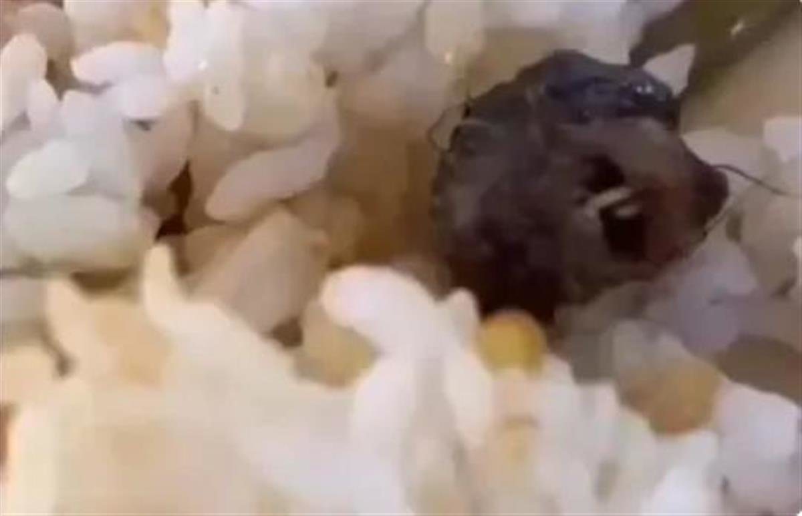

# 江西工业职业技术学院食堂吃出的是鸭脖还是鼠头？南昌市监部门已送检

[极目新闻](https://ishare.ifeng.com/mediaShare/home/1567258/media)

[2023年06月06日 21:04:09 来自湖北](https://ishare.ifeng.com/mediaShare/home/1567258/media)

极目新闻记者 陈俊

近日，江西工业职业技术学院官微6月3日通报“食堂吃出老鼠头”事件后，由于官方和网友的反应不一，6月6日，“长牙的鸭脖令人如鲠在喉”话题又登上热搜。

图源：视频截图

到底吃出的是鸭脖还是鼠头？南昌市检验检测中心方面表示，相关情况只会向送检方通报。据上游新闻报道，记者从一位啮齿类动物研究专家处了解到，如果图片没有作假，那么80%（概率）可以确定是小鼠头部。

6月1日，题为“江西一高校饭菜中吃出老鼠头”的视频在网络引发关注，6月3日晚，江西工业职业技术学院官方微博发布情况通报回应此事称，当事学生本人在事发当时即邀请同学共同对“异物”进行了对比，确认“异物”为鸭脖，为正常食物，该学生已现场作出书面说明，对视频内容进行澄清。

6月3日，江西广播电视台某栏目发布的报道中，南昌市高新区市场监督管理局昌东分局局长江协学介绍，执法人员第一时间赶到现场，反复对比，确认这个异物就是鸭脖。

图源：视频截图

4日，央广网发自南昌的报道称，当天，记者通过走访了解到，事发现场，高新区市场监管局相关人员通过查看当事人拍摄的图片进行比对，初步判定系鸭脖，并对该校菜品的留样进行检测，将于3—5天专业比对后公布结果。目前，南昌市场监管局已经介入。

但多方回应并未让该事件平息，反而在网上引起了轩然大波，有网友质疑“这谁来看都不是鸭脖”“鸭脖怎么长了牙”“指鼠为鸭”。“长牙的鸭脖令人如鲠在喉”一度冲上热搜。

6月6日，上游新闻记者联系到了“鸭脖”送检的南昌市检验检测中心，办公室一位工作人员回应称，“鸭脖”的确在该中心进行检验，但相关结果只能向送检方市场监管局进行通报，不能向外界透露。

那么这个引发轩然大波的“异物”到底是鸭脖还是鼠头？6日下午，上游新闻记者联系到某高校一位从事啮齿类动物研究30多年的专家，他表示自己已经看到了新闻图片，“仅仅从图片来看，如果图片属实的话，那应该就是一个小鼠的头部。”

图源：视频截图

这位专家表示，自己只看到了图片没有看视频，“它有上下的门齿，新闻里有一个正面的图，它有鼠的犬齿，特别是下面犬齿很长，它会生长，如果图片没有造假，我觉得那就是鼠头，如果是鸭脖的话，它不会有那种白色的东西。 ”

专家也谈了自己判断的原因，“啮齿动物的头骨，特别是它的两颗牙，它的上牙短，下牙很长，这个是很明显的。因为它终身都会长，不会像人类牙齿，长到一定长度就不长了 。”

“但我要强调，图片不是特别清晰，也不排除是PS了两颗牙。”专家最后表示：“不管是长度、形状，而且正好是上下两颗， 从我的经验看，如果图片真实的话，哪怕不是很清楚或者只有一个角度，我大致80%（概率）认为那是个鼠头”。

江西工业职业技术学院是1999年经教育部批准成立的江西省首批独立设置的公办全日制综合性高等职业院校，是江西省示范性高等职业院校。