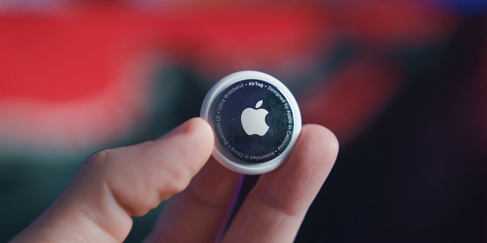

# AirTags reveal officials in Mexico stole items donated for earthquake relief in Turkey

[Chance Miller](https://9to5mac.com/author/chmiller44/) | Jun 8 2023 - 10:55 am PT

[1 Comment](https://9to5mac.com/2023/06/08/airtags-reveal-officials-in-mexico-stole-items-donated-for-earthquake-relief-in-turkey/#comments)

Earlier this year, [*Reuters* published](https://9to5mac.com/2023/02/26/airtags-recycling-report-reuters/) an excellent report exposing the false recycling practices of Dow Inc. and the Singapore government using Apple’s AirTag item tracker. In a similar vein, [journalist Pamela Cerdeira](https://www.youtube.com/watch?v=3uSc3bEQoCY) has now shared a new video in which she used AirTags to track donations made in Mexico that were supposed to be sent to Turkey in response to the devastating earthquakes that hit the country earlier this year.

The donations were collected by the Mexico government, but it turns out those donations never made it to Turkey. In fact, they never made it out of Mexico City.

In a video published on YouTube, Cerdeira explains that she donated two things (a bag of rice and a package of toilet paper) to donation centers located in Mexico City that were set up to collect goods for Turkey. When she made the donations, however, she was skeptical that they would ultimately end up in Turkey, so she placed an AirTag inside both of them.

As it became clear via Find My that the donated items weren’t actually going to make their way to Turkey as promised, Cerdeira ventured out into Mexico City to track them down. According to the Find My app, the two donations had been separated, but neither of them was delivered to Turkey as promised.

Using the Find My app, Cerdeira discovered that both donations had ended up at separate markets where they were being resold by vendors. She went to the location shown by the Find My app for the bag of rice, but they wouldn’t let her in the building. She then visited the market where the package of toilet paper was located and used Precision Finding to locate it and confirm that it was being resold.

Whether or not this is a widespread outcome for donations made in Mexico remains to be seen. Government officials, however, [promised to investigate](https://twitter.com/martibatres/status/1666557308606861312) Cerdeira’s findings.

This is yet another instance showing just how versatile AirTags can be. Along with stories like this one, we’ve seen AirTags be used for [tracking stolen cars](https://9to5mac.com/2022/07/25/airtag-finds-stolen-suv/), [stolen money](https://9to5mac.com/2023/05/05/airtag-credited-with-helping-investigators-locate-1-1m-in-cash-stolen-from-armored-truck/), and of course, everyday items like keys.

AirTags 显示墨西哥官员盗窃了为土耳其抗震救灾捐赠的物品 (https://9to5mac.com/2023/06/08/airtags-reveal-officials-in-mexico-stole-items-donated-for-earthquake-relief-in-turkey/)

今年早些时候，路透社(Reuters)发表了一篇精彩的报道，揭露了陶氏化学公司(Dow Inc.)和新加坡政府使用苹果的AirTag物品追踪器进行虚假回收的行为。

同样，记者Pamela Cerdeira分享了一段新的视频，她在视频中使用AirTags追踪墨西哥的捐款，这些捐款本应被送往土耳其，以应对今年早些时候发生的毁灭性地震。

这些捐赠是由墨西哥政府收集的，但事实证明这些捐赠从未到达土耳其。事实上，他们从未离开过墨西哥城。

在YouTube上发布的一段视频中，Cerdeira解释说，她向位于墨西哥城的捐赠中心捐赠了两样东西(一袋大米和一包卫生纸)，这些捐赠中心是为土耳其收集物资而设立的。然而，当她捐赠的时候，她怀疑这些钱最终是否会被送到土耳其，所以她在两个盒子里都放了一个AirTags。

通过Find My，人们发现捐赠的物品实际上并没有像承诺的那样到达土耳其，于是Cerdeira冒险前往墨西哥城寻找它们。“Find My”应用显示，这两笔捐款是分开的，但都没有按照承诺送到土耳其。

通过“Find My”应用程序，Cerdeira发现，这两笔捐款最终都被送到了不同的市场，由供应商转售。她去“Find My”应用程序显示的位置取米，但他们不让她进大楼。然后，她去了卫生纸包装所在的市场，并使用Precision Finding找到了它，并确认它被转售。

🗒 标签: #AirTags #Apple
📢 频道: @GodlyNews1
🤖 投稿: @Godlynewsbot