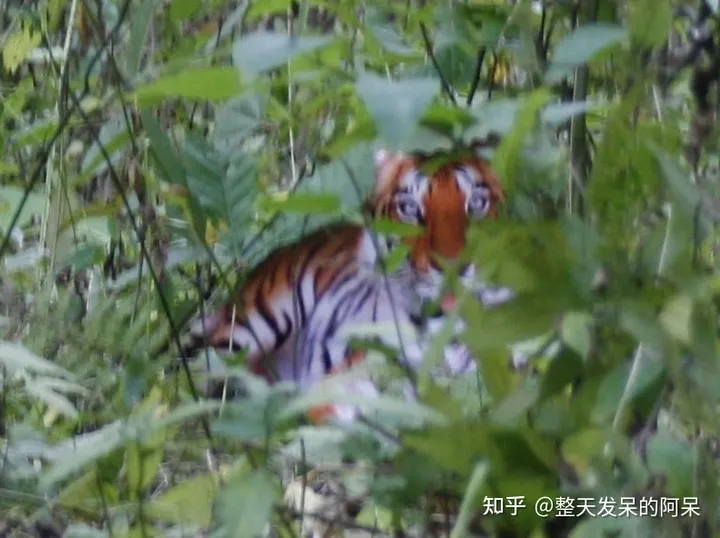
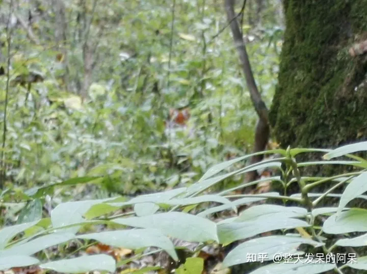

https://www.zhihu.com/question/605866370/answer/3068424468

[整天发呆的阿呆](https://www.zhihu.com/people/a-ai-81-27)

 关注

[苏沉船](https://www.zhihu.com/people/su-chen-chuan)

、

[yun zi](https://www.zhihu.com/people/yun-zi-70-69)

 等 6,160 人赞同了该回答

互联网有没有记忆？

这剧情不熟悉？

2007年10月3日，陕西省安康市镇坪县[文彩村](https://www.zhihu.com/search?q=文彩村&search_source=Entity&hybrid_search_source=Entity&hybrid_search_extra={"sourceType"%3A"answer"%2C"sourceId"%3A3068424468})七组村民周正龙在该县神州湾一处山崖旁，声称同时用胶片和数码相机，同时“拍”下一组“华南虎”照片。

经陕西省林业厅组织野生动物专家和影像专家共同鉴定，照片是真实的。

同月12日，陕西省林业厅举行了盛大的发布会，宣布“镇坪县发现野生华南虎”，并展示了农民周正龙拍摄的3张老虎照片，还向其颁发奖金人民币2万元。

而该图片上网后，因为无论从哪个角度看，这只老虎都过于平面化，与环境格格不入。其两毛半的ps效果引发网友群嘲。

不久，网友“攀枝花xydz”在色影无忌华南虎里发帖称：“老虎是假的。我今天仔细看我家的一副挂在墙上的老虎画，除了耳朵不一样，哪里都是一样的，连老虎的纹路都是一样的。但我不知道怎么传图，我已经照下来了。”网友小鱼啵啵啵将他收到的图片发到了同一论坛，《人肉引擎搜索结果，请看[四川攀枝花](https://www.zhihu.com/search?q=四川攀枝花&search_source=Entity&hybrid_search_source=Entity&hybrid_search_extra={"sourceType"%3A"answer"%2C"sourceId"%3A3068424468})朋友给我发的疑似老虎原图》。这张照片刚一出来，各路高手立即将年画老虎与“周老虎”进行了比对，有眼睛的网友一律得出结论：这同一只老虎！

正当周正龙深陷争议时，林业厅领导来到周正龙家慰问，他亲自给周点上一根香烟。副厅级官员给自己点烟，这是一个农民能吹一辈子的事情。他对周正龙表示了支持，他说：“周正龙的精神可贵，我们应该关心他，尊重他才是。

11月21日，陕西省林业厅首次回应年画老虎，建议通过刑事调查等渠道解决年画老虎与周正龙拍摄的照片之间引发的争议。

11月26日，有媒体公布周正龙拍摄的全套40张原始“野生华南虎”数码照片。周正龙表示要起诉“私自发布虎照”。

12月3日，来自六个方面的鉴定报告和专家意见汇总认为虎照为假。

12月3日，陕西省林业厅发表声明，未就照片鉴定做出回应。

12月4日，国家林业局称，华南虎照片中的老虎是真是假，是否是活体，都难以评估该地区野生华南虎的生存状况；国家林业局不会“越位”鉴定华南虎照片的真伪。

12月10日，围绕“华南虎照片”事件，青年法律学者[郝劲松](https://www.zhihu.com/search?q=郝劲松&search_source=Entity&hybrid_search_source=Entity&hybrid_search_extra={"sourceType"%3A"answer"%2C"sourceId"%3A3068424468})向北京市第二中级法院递交诉状，状告国家林业局。郝劲松在诉状中请求法院撤销国家林业局此前对他作出的行政复议不予受理决定书，并请求法院判令国家林业局受理其提出的复议申请。

12月14日，《科学》杂志又刊发华南虎年画图片，并配发短文介绍了近期[中国摄影师协会](https://www.zhihu.com/search?q=中国摄影师协会&search_source=Entity&hybrid_search_source=Entity&hybrid_search_extra={"sourceType"%3A"answer"%2C"sourceId"%3A3068424468})和国家林业局的一些活动和反应。该杂志仍未发表任何鉴定性的评论。

12月18日，媒体报道，北京市第二中级法院以郝劲松申请复议的行为并非[具体行政行为](https://link.zhihu.com/?target=https%3A//baike.baidu.com/item/%E5%85%B7%E4%BD%93%E8%A1%8C%E6%94%BF%E8%A1%8C%E4%B8%BA)，其起诉不符合法律规定的起诉条件为由，裁定不予受理其起诉。

12月19日，在国家林业局举行的新闻发布会上，林业局保护司司长[卓榕生](https://www.zhihu.com/search?q=卓榕生&search_source=Entity&hybrid_search_source=Entity&hybrid_search_extra={"sourceType"%3A"answer"%2C"sourceId"%3A3068424468})表示，国家林业局已要求陕西省林业厅委托国家专业鉴定机构对周正龙所拍摄的华南虎照片等原始材料依法进行鉴定，并如实公布鉴定结果。当日，陕西省林业厅信息宣传中心主任[关克](https://link.zhihu.com/?target=https%3A//baike.baidu.com/item/%E5%85%B3%E5%85%8B)表示，陕西省林业厅已正式收到了国家林业局指示。林业厅正在积极贯彻落实国家林业局的指示，委托公众认可的鉴定机构对华南虎照片进行重新鉴定。

12月20日，媒体报道，有网友爆料称：2007年1月、2月间，[镇坪](https://link.zhihu.com/?target=https%3A//baike.baidu.com/item/%E9%95%87%E5%9D%AA)县林业局曾向陕西省林业厅派遣的华南虎调查队送礼送钱。次日，镇坪县林业局局长[覃大鹏](https://link.zhihu.com/?target=https%3A//baike.baidu.com/item/%E8%A6%83%E5%A4%A7%E9%B9%8F)向媒体回应：“账本一事是对镇坪和华南虎调查队的诬陷。”

12月24日，郝劲松正式向北京市高院提起诉状，请求指定[北京市二中](https://link.zhihu.com/?target=https%3A//baike.baidu.com/item/%E5%8C%97%E4%BA%AC%E5%B8%82%E4%BA%8C%E4%B8%AD)院受理诉国家林业局一案。

12月27日，国家林业局新闻发言人、新闻办主任[曹清尧](https://www.zhihu.com/search?q=曹清尧&search_source=Entity&hybrid_search_source=Entity&hybrid_search_extra={"sourceType"%3A"answer"%2C"sourceId"%3A3068424468})在新华网作在线访谈时表示，华南虎照片的鉴定工作已取得了突破性的一步。陕西林业厅根据国家林业局和[陕西省人民政府](https://link.zhihu.com/?target=https%3A//baike.baidu.com/item/%E9%99%95%E8%A5%BF%E7%9C%81%E4%BA%BA%E6%B0%91%E6%94%BF%E5%BA%9C)的要求，已经将照片送到了国家权威机构来进行鉴定。广大网民、广大公众很快就会知道“虎照”的真伪。

12月29日，镇坪林业局一位陪同国家林业局上山寻虎的动管站技术人员张斌报料，国家林业局的专家们在镇坪再次发现虎讯、虎踪数起，其中包括一百多个疑似华南虎脚印，以及一副完整的疑似华南虎幼崽骨架等。

2008年

1月7日，事件中被认为是华南虎原始图像来源的年画虎生产商[骆光临](https://www.zhihu.com/search?q=骆光临&search_source=Entity&hybrid_search_source=Entity&hybrid_search_extra={"sourceType"%3A"answer"%2C"sourceId"%3A3068424468})向浙江义乌市人民法院递交诉状，状告周正龙与关克侵犯名誉权，要求周正龙公开道歉并赔偿一万元，要求关克公开道歉并赔偿两万元。

2月4日，陕西省林业厅就“草率发布发现华南虎的重大信息”发出《[向社会公众的致歉信](https://www.zhihu.com/search?q=向社会公众的致歉信&search_source=Entity&hybrid_search_source=Entity&hybrid_search_extra={"sourceType"%3A"answer"%2C"sourceId"%3A3068424468})》。致歉信说，“在缺乏实体证据的情况下，就草率发布发现华南虎的重大信息，反映出我厅存在着工作作风漂浮、工作纪律涣散等问题。”并称，“关于华南虎照片的委托鉴定问题，按照国家林业局和省政府的要求，已经做了大量工作，我们将继续予以推进，一有结果我们接受国家专业鉴定机构的鉴定结论，并如实向社会公布。”当天另有消息称，国家林业局某官员私下透露，陕西省林业厅副厅长[朱巨龙](https://link.zhihu.com/?target=https%3A//baike.baidu.com/item/%E6%9C%B1%E5%B7%A8%E9%BE%99)已在2月3日被停职。

2月20日，媒体报道称，国家林业局一位官员透露：虎照二次鉴定尚未开始。陕西省林业厅最初委托的鉴定机构是[公安部物证鉴定中心](https://link.zhihu.com/?target=https%3A//baike.baidu.com/item/%E5%85%AC%E5%AE%89%E9%83%A8%E7%89%A9%E8%AF%81%E9%89%B4%E5%AE%9A%E4%B8%AD%E5%BF%83)，但该鉴定中心不肯接受委托。此后，陕西省林业厅又找了几家鉴定机构，但“确实没有权威鉴定机构愿意沾这个事”。

3月4日，陕西省长[袁纯清](https://link.zhihu.com/?target=https%3A//baike.baidu.com/item/%E8%A2%81%E7%BA%AF%E6%B8%85)在接受新华社专访时，被问到华南虎照问题，袁纯清表示陕西省政府对[华南虎照事件](https://www.zhihu.com/search?q=华南虎照事件&search_source=Entity&hybrid_search_source=Entity&hybrid_search_extra={"sourceType"%3A"answer"%2C"sourceId"%3A3068424468})的态度是“明确”的，“但是在即将开幕的两会上，我们应该把精力主要放在讨论政府工作报告上，”袁纯清说。

3月7日，司法部副部长[赵大程](https://link.zhihu.com/?target=https%3A//baike.baidu.com/item/%E8%B5%B5%E5%A4%A7%E7%A8%8B)在列席全国政协界别联组讨论间隙接受媒体采访时表示，“虎照门”的有关问题、有关事实查清楚之后，将依照法律进行处理，这是毋庸置疑的。

3月10日，在媒体追问下，朱巨龙证实，自己还在上班，工作也没有调动。针对全国“两会”上华南虎形成的舆论焦点，朱巨龙笑称，自己没有什么压力。

4月10日，媒体披露，矗立在陕西镇坪县街头的巨幅广告牌：“游自然国心、闻华南虎啸、品镇坪腊肉”，已经被悄然撤换。

5月8日，美国著名华人刑侦专家李昌钰博士在福建一场专题演讲中，否认了“华南虎”照片的真实性，并说：“照片后期处理得相当好，我只能说咱们中国农民很不错，PS的水平太高了。”

5月12日，学者郝劲松根据《政府信息公开条例》，向国家林业局递交申请，要求公开“虎照”信息。

5月26日，媒体披露，针对浙江义乌市[威斯特](https://link.zhihu.com/?target=https%3A//baike.baidu.com/item/%E5%A8%81%E6%96%AF%E7%89%B9)彩印包装有限公司诉周正龙与陕西省林业厅宣传中心主任关克名誉权纠纷案件，浙江[金华市](https://link.zhihu.com/?target=https%3A//baike.baidu.com/item/%E9%87%91%E5%8D%8E%E5%B8%82)中级人民法院已终审裁定周正龙提出的级别管辖异议不能成立，驳回上诉。此前，关克的上诉已被金华市中院驳回。义乌市法院将启动华南虎照案件庭审。

6月17日，国家林业局针对郝劲松要求公开关于华南虎照片信息的申请进行了答复，称“陕西镇坪华南虎照片等原始材料委托国家专业机构进行鉴定”，但对于二次鉴定何时结束并未答复。

6月23日，郝劲松到西安市[莲湖区](https://link.zhihu.com/?target=https%3A//baike.baidu.com/item/%E8%8E%B2%E6%B9%96%E5%8C%BA)法院起诉陕西林业厅，要求根据《[政府信息公开条例](https://link.zhihu.com/?target=https%3A//baike.baidu.com/item/%E6%94%BF%E5%BA%9C%E4%BF%A1%E6%81%AF%E5%85%AC%E5%BC%80%E6%9D%A1%E4%BE%8B)》公开相关信息。

6月24日，陕西省林业厅一知情人士向媒体透露，周正龙已于两周前因“私藏违禁物品”被陕西警方带走。知情人声称，周已经向警方坦白了作假的过程，该虎照的原型确实只是一张老虎图片。

6月26日，被视为“挺虎派”重要人士的北京师范大学[刘里远](https://link.zhihu.com/?target=https%3A//baike.baidu.com/item/%E5%88%98%E9%87%8C%E8%BF%9C)教授向媒体称，周正龙于2008年4月拍到了华南虎的清晰脚印。

6月29日，陕西省政府新闻发言人、省政府办公厅、省公安厅、省监察厅的负责人出席新闻发布会，向公众通报“华南虎照片事件”调查处理情况。

## 结果

2007年11月27日至12月2日，中国摄影家协会数码影像鉴定中心邀请了资深数码影像专家、野生动物摄影家、视觉文化评论家、摄影家、数码影像工作者等组成的专家组对四十张华南虎照片进行鉴定，从摄影学和数码影像技术学两个方向分析。12月2日晚，到会专家经过严肃的辨识和分析，得出三个结论：网易公司提供的40幅影像不是真正的照相机原始文件，但确实是公开传媒上所能见到并广泛传播的，作为华南虎存在证据的影像；40幅影像是具有一定摄影经验的人拍摄或者指导拍摄，不应是一个毫无摄影经验者独立拍摄的；根据目前影像呈现的效果进行摄影学分析，该40幅影像作为华南虎存在证据属性的影像是不真实的。

2008年11月17日，陕西省[安康市](https://link.zhihu.com/?target=https%3A//baike.baidu.com/item/%E5%AE%89%E5%BA%B7%E5%B8%82)中级人民法院在旬阳县法院大审判庭对“华南虎照”造假者周正龙案进行公开开庭审理。经过长达12个多小时的庭审，安康市中院二审判决被告人周正龙犯[诈骗罪](https://link.zhihu.com/?target=https%3A//baike.baidu.com/item/%E8%AF%88%E9%AA%97%E7%BD%AA)，判处有期徒刑两年，并处罚金2000元；犯非法持有弹药罪，判处有期徒刑一年零六个月。总和刑期三年零六个月，决定执行有期徒刑两年零六个月，宣告缓刑，缓刑考验期三年，并处罚金2000元。本判决为终审判决。

（以上内容部分援引自百度百科）

…………分割线…………

在那个时候，几乎只要是个有眼睛的人，就看得出华南虎图是假的。

然而就是在这种前提下，一堆高层次专家前仆后继，各方力量各有顾忌，“各司其职”，让这场闹剧折腾了一年多，浪费了无数社会资源，得出了一个人尽皆知的结论。

至于当事人确认是鸭脖这一段，我不知道你们想起啥，

我想起那只承认自己是兔子的熊。

历史不重演，却甜蜜的总在押韵。

[编辑于 2023-06-11 16:45](https://www.zhihu.com/question/605866370/answer/3068424468)・IP 属地广东