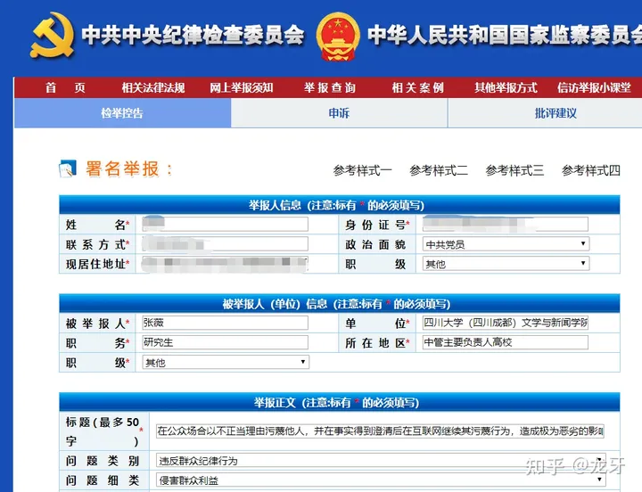

https://www.zhihu.com/question/606044944/answer/3069672043

[龙牙](https://www.zhihu.com/people/long-ya-57-84)

已关注

21,765 人赞同了该回答

此人心机深不可测，具有非常明显的表演型人格和反[社会人格](https://www.zhihu.com/search?q=社会人格&search_source=Entity&hybrid_search_source=Entity&hybrid_search_extra={"sourceType"%3A"answer"%2C"sourceId"%3A3069672043})，智商再高一点的话是有极大的现实社会威胁的。奈何确实不是很聪明的亚子，一篇[道歉信](https://www.zhihu.com/search?q=道歉信&search_source=Entity&hybrid_search_source=Entity&hybrid_search_extra={"sourceType"%3A"answer"%2C"sourceId"%3A3069672043})写得[味同嚼蜡](https://www.zhihu.com/search?q=味同嚼蜡&search_source=Entity&hybrid_search_source=Entity&hybrid_search_extra={"sourceType"%3A"answer"%2C"sourceId"%3A3069672043})，除了进一步激起社会警惕和厌恶之外没什么效果。我比较好奇的是这么一个二十出头的人是怎么形成如此不符合年龄的心机的，我们的教育体制和价值取向是不是已经出了很大的问题？

对于此人行为，我前两天已经提出了举报，反响很大，这里就不再赘言。

需要详细解析的是此人令人恐惧的内心世界，相信为其洗地的人，包括某著名小报原主编、向来喜欢左右横跳博眼球的某老胡，恐怕也并不愿意与这种人接触吧？这个不是道歉信不道歉信的问题，她这个道歉信本身就是其表演的一部分而已，只能让你浑身发毛，我觉得从她身上表现出来的那种可怕的秉性来看清楚这个人才是关键，也预防以后落在这种人手里。

首先是其明显的表演型人格，她在微博、[小红书](https://www.zhihu.com/search?q=小红书&search_source=Entity&hybrid_search_source=Entity&hybrid_search_extra={"sourceType"%3A"answer"%2C"sourceId"%3A3069672043})、抖音、B站各个平台有着完全不一样的“人设”。这种操作在互联网运营里很正常，很多人也被这个“行规”所麻痹了。

可是别人的“人设”是同一个人的不同侧面，她这“人设”是完全矛盾的好几个人。在微博上高喊口号煽动情绪，在小红书又打造“[成功女性](https://www.zhihu.com/search?q=成功女性&search_source=Entity&hybrid_search_source=Entity&hybrid_search_extra={"sourceType"%3A"answer"%2C"sourceId"%3A3069672043})”人设，在抖音毫不犹豫吃男女矛盾的饭，在B站又教别人抵制彩礼，这个属于把各个平台的潜规则都玩儿“明白”了。

可见其“人设”就真的是人设，是完全虚构的表演，能跨四个格格不入的平台表演得如此丝滑，真的也挺不容易的。

可惜的是这人智商属实不够，堵上把自己搞成[人格分裂](https://www.zhihu.com/search?q=人格分裂&search_source=Entity&hybrid_search_source=Entity&hybrid_search_extra={"sourceType"%3A"answer"%2C"sourceId"%3A3069672043})的风险，放纵表演型人格发挥，也没把多平台矩阵号玩儿明白。没整明白多“人设”怎么弄，终归悟性不够强，真的跨平台多人设哪里是这么玩的，你把你自己人格的多个侧面，片面截取出来往各个平台放不就完了嘛，那些平台用户哪儿整的明白这些隐喻？偏要搞多重人格式精神分裂，属实[偷鸡不成蚀把米](https://www.zhihu.com/search?q=偷鸡不成蚀把米&search_source=Entity&hybrid_search_source=Entity&hybrid_search_extra={"sourceType"%3A"answer"%2C"sourceId"%3A3069672043})。

其次是她“有便宜不占王八蛋”的极端精致[利己主义](https://www.zhihu.com/search?q=利己主义&search_source=Entity&hybrid_search_source=Entity&hybrid_search_extra={"sourceType"%3A"answer"%2C"sourceId"%3A3069672043})者价值观。学生党员、保研、还在拼命想成“网红”，可见此人是生活中一切便宜都要占的那种人，完全不懂得取舍，更不会有任何“让利”他人的可能性。

利己并没有什么问题，偶尔以利己作为一切的中心，也行，可是随时随地做到一切便宜都不放过，那就叫极端，是无所不用其极的利己主义者。

很多人容易把“上进心”与极端利己混淆，上进心是指向自己的，极端利己是指向外界的，一个是自我完善，另一个就像箩筐里的螃蟹，踩着别人抬高自己。

比较遗憾的是很多时候我们的社会把这两者搞混了，想要提高自己就得踩死别人，这就是内卷，完善自己没用、踩死别人才行。

此女把一个大学生本科期间能够拿到的好处都捞到了手里，保研怎么保的？入党怎么入的？相信读过大学的都明白。这里只说其入党动机，这种入党动机肯定是不纯的，毫无任何党性可言，内心是不认同共产主义价值观的，很可能根本没把“党员义务”当成一回事，跟某个学期[三好学生](https://www.zhihu.com/search?q=三好学生&search_source=Entity&hybrid_search_source=Entity&hybrid_search_extra={"sourceType"%3A"answer"%2C"sourceId"%3A3069672043})搞混了，满以为纯属是某一项福利呢。

这种行为背后就是极端利己主义的价值观，见到好处没捞到手里，比杀了她还要难受，任何人出现在她身边恐怕都得小心一点，谨防她趁你不备就剜你一刀。

然后是对弱者的极端残暴。只要你是弱者，欺负你、虐待你就是天经地义，这就是她内心里真实想法，不管你是不是无辜的。从她对待大叔的方式就可以看出，虐待弱者让她获得了快感。

毫无疑问在这种公开场合，这个农民工大叔是完全的弱者，即使他身强力壮，在这个环境里他也手无缚鸡之力。而张薇身为新闻传播专业研究生，女性、外表靓丽，在当前社会环境与地铁这种公共空间，是毫无疑问的强者，恃强凌弱顺理成章。

这从她事后言论可以看出来，公开让一个连智能手机都不大会用的农民工大叔跟她“对线”，说出“你没干你为什么不辩解”这种话，这已经是非常明显的躲在对自己极端有利的必胜环境里对弱者的凌霸与虐待、残害了。

而且她对此充满了快感。

从她事后互联网上的言论可见，其本人非常享受这次凌霸残害，躲在安全的地方肆意虐待一个没有反抗能力的人，让她内心得到了满足，让她自觉强大、安全、快慰。直到本次所谓的“道歉”，依旧在使用小号攻击、蔑视社会舆论，可见其恃强凌弱的变态心理已经到了反社会的程度，这是很典型的反社会人格。

这个置顶评论就是她自己的小号，头像都没舍得换一个，使用的词汇是“跳脚”这种明显的贬义词，意思是她没错，整个社会错了，是全社会在跳脚而已。

我们知道虐猫虐狗是变态行为，[虐待动物](https://www.zhihu.com/search?q=虐待动物&search_source=Entity&hybrid_search_source=Entity&hybrid_search_extra={"sourceType"%3A"answer"%2C"sourceId"%3A3069672043})是心理扭曲，虐待活人当然也是。你去草原上跟狮子拼命然后杀死狮子，没人说你是虐杀；你把狮子麻醉以后绑起来一刀一刀割死，那就是虐杀，你就是变态，这是常识，不要混淆。你光明正大跟实力相当的人在公平的环境里对线，那很正常；你阴暗的利用自己的专业知识在绝对安全的环境里先立于不败之地然后对一个无辜的人不依不饶、必置之死地而后快，这是什么行为？

这就是残害、虐待、变态、扭曲。

就像一个男的，专门去抓老鼠然后绑起来，用打火机慢慢烧死取乐，你会放心跟这种人待在一起？这女的这种行为与此并无两样。

最后就是使用小号在道歉言论下方再次表达对社会的不满。

如果只是自己变态、扭曲还好，死不悔改，那就很有问题了。

此前此人早已表达过“绝不悔改”的意思，是受害者报警以后出于对后果的担忧选择了道歉，其内心里不仅毫无歉意，反而对社会的仇恨更深了。一个极端利己主义、表演型人格，还以凌虐残害取乐的人，配合上“我绝不会错、错的是整个世界”的封闭自我意识，这是什么呢？

这是个具有较高知识水平的潜在罪犯，没办法改造那种。

按照其本人的逻辑，应该是提前枪毙完事儿，所谓“没有受到侵害就不用维权吗”，我分析逻辑清楚明白，后果引申适当，按照她的逻辑最好是提前崩了算了。然而这是她变态人格反社会言论的逻辑，不是我们正常人秉承的规则，我们不可能干“提前预防性枪毙”这种事情。

但是还是要意识到这个人是无法拯救的。

不管是党组织，还是学校，甚至是家人、朋友，哪怕是“爱”，不可能感化这种已经深入骨髓的毒。我们的社会讲究一个“就事论事”，法律不惩处尚未发生的事情，但是社会道德不是这样，万万不可以对无可救药的人付出。这人内心里早就埋下了根本不可能清除的毒，还已经封闭了被规劝、被纠正的可能性，你指望用爱去感化她，那是不可能的。

她本来就认为自己没错，即使错那也是整个世界错了，那么其实你哪怕是劝说她意识到自己错了，也足够让你粉身碎骨。

不管男女，建议是远离这种人，你承受不起的。对这种人任何的感情与现实付出都是白费劲，无论是爱情还是友情，都是拿去打水漂。哪怕你仅仅是跟她成为同盟，被她出卖换取利益也是早晚的事情。这种人哪怕是极端女权主义者都最好别碰，哪怕是反华势力建议是都不要弄过去，否则，被背叛的时候请提前做好准备。

这种人更不要让她入党，混进党员队伍、掌握权力。

我一个老实巴交的普通老百姓，承受不起，所以我举报了。

举报文字很多网友叫我打出来，这是不行的。大家可能对党的组织纪律不清楚，我打出来复制交给你那叫做“串联”、“串告”，是组织纪律不允许的。而截图只是证明我确实实施了举报，是证明性质的公开，不存在“教唆”、“指使”、“煽动”他人共同举报的嫌疑。本文在此也声明，举报仅仅是本人作为党员的合法权利，是本人出于激愤的个人行为，不存在任何鼓励、指使他人一同举报的意图。

特此声明。

[发布于 2023-06-12 08:50](https://www.zhihu.com/question/606044944/answer/3069672043)・IP 属地四川