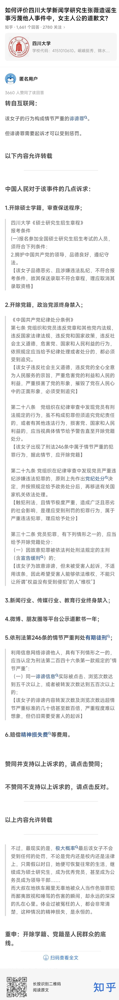

https://www.zhihu.com/question/606126417/answer/3070970284

匿名用户

2,307 人赞同了该回答

## 上图的回答已被知乎全面屏蔽。

该回答链接：https://www.zhihu.com/question/606044944/answer/3069501349

*[大英帝国](https://www.zhihu.com/search?q=大英帝国&search_source=Entity&hybrid_search_source=Entity&hybrid_search_extra={"sourceType"%3A"answer"%2C"sourceId"%3A3070970284})这次真的赚大了。*

*只用一个人，就彻底摧毁了我们长期为之努力的“依法治国”和“从严治党”。更加践踏了党纪国法，动摇了我们的国本。*

------

造谣诽谤者为男时，人民的媒体们说：严惩造谣者，让造谣者付出惨重代价！

造谣诽谤者为女时，人民的媒体们说：要就此划上[休止符](https://www.zhihu.com/search?q=休止符&search_source=Entity&hybrid_search_source=Entity&hybrid_search_extra={"sourceType"%3A"answer"%2C"sourceId"%3A3070970284})，要警惕有心人煽动性别对立！

到底是谁在煽动对立啊？不就是这些所谓的喊着不要对立的媒体吗？

------

抖音的“张捷[财经观察](https://www.zhihu.com/search?q=财经观察&search_source=Entity&hybrid_search_source=Entity&hybrid_search_extra={"sourceType"%3A"answer"%2C"sourceId"%3A3070970284})”说出了问题的核心。

这一次很有可能是英国有预谋策划的事件。

如果不严惩，那么很有可能会被西方趁势挑起严重的性别对立。

例如[人民日报](https://www.zhihu.com/search?q=人民日报&search_source=Entity&hybrid_search_source=Entity&hybrid_search_extra={"sourceType"%3A"answer"%2C"sourceId"%3A3070970284})说要划上休止符，这就是在推动性别对立。推动人民内部的分裂，动摇我们国家的根基。

还有的说要警惕性别对立却又要求不惩罚该女子想息事宁人的，这种就是典型的打着反性别对立的旗号，做着大力推动性别对立的事的。

所以，真要防止西方在我国推动性别对立进而推动颜色革命，就必须依照党纪国法严惩不贷。

而目前只是要求惩，都做不到，更别说严惩了。

很多媒体以为自己在平息事态，但公然践踏党纪国法，只会让事态更加严重难以平息，最后反而让西方国家得偿所愿，反而只会让人民群众对党纪国法失去信任。

长远来看，甚至很有可能动摇我们的国本。但人民日报显然没看到这一点，误以为只要平息了事态，践踏一次党纪国法也无妨，而数十年数百年后的历史书上，这很有可能被定义为西方颠覆我们国家的成功开端。

[编辑于 2023-06-15 08:09](https://www.zhihu.com/question/606126417/answer/3070970284)・IP 属地广东